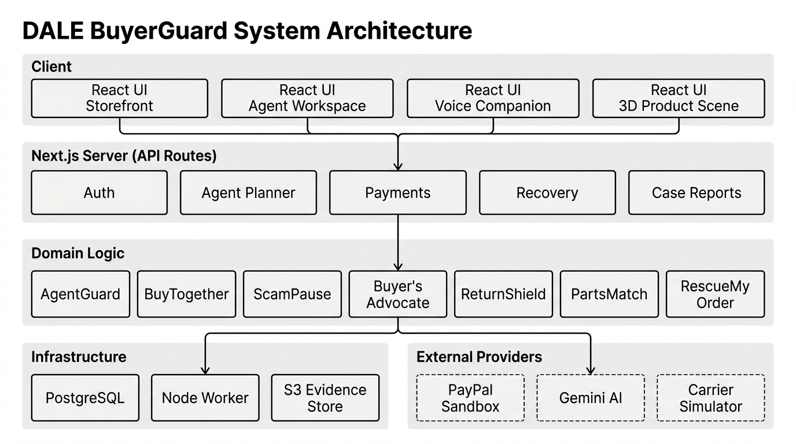
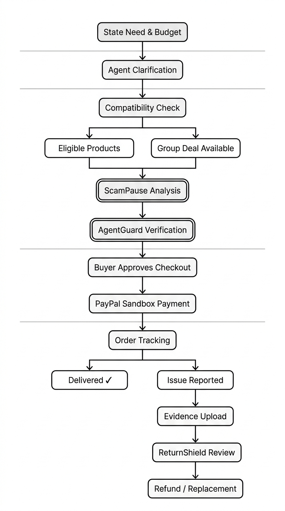

# DALE — BuyerGuard

**A customer-first AI shopping agent built for the PayPal AI Hackathon 2026.**

DALE combines AI-assisted product discovery, compatibility matching, group discounts, fraud detection, and evidence-backed returns into a single, coherent shopper experience — all integrated with PayPal sandbox payments.

> **Promise:** Find the right product, pay safely, and receive a clear, fair resolution when something goes wrong.

Current tested acceptance is **80% complete / 20% pending (16 of 20 checkpoints)**; the bounded feature implementation is present. Genuine sandbox financial completion, no-spend live AI/voice evaluation, staged physical labels and five independent testers remain separate acceptance gates. The public and local builds can differ: see [current release evidence](docs/VALIDATION.md), [progress](docs/PROJECT_PROGRESS.md) and [new manual journeys](docs/CURRENT_ACCEPTANCE.md).

---

## Overview

DALE is a modular, production-grade Next.js application that acts as a buyer's advocate through every stage of an electronics purchase. Seven bounded capabilities work together under one shopping journey rather than as disconnected features.

The storefront is named **DALE**. The application package is `buyerguard`. Both names refer to the same codebase.

**Hackathon deadline:** 13 November 2026, 1:30 AM IST — Demo maintained through 15 December 2026.

---

## The Seven Capabilities

| ID | Capability | What it does |
|---|---|---|
| BG-01 | **AgentGuard** | Server-side verification of payee, amount, item, currency, and approval version before any payment executes |
| BG-02 | **BuyTogether** | Same-SKU group formation with merchant-approved discount tiers and individual checkout; no pooled funds |
| BG-03 | **ScamPause** | Clause-sensitive analysis of voluntarily shared messages and listing content; specific reasons and safer next steps |
| BG-04 | **Buyer's Advocate** | Catalog-grounded comparisons with explicit shopper preference weights; sponsorship cannot improve organic rank |
| BG-05 | **ReturnShield** | Four authorized evidence checkpoints, claim analysis, human review, remedy execution, and exportable case report |
| BG-06 | **PartsMatch** | OCR-assisted identification, canonical model IDs, and a curated compatibility graph for electronics accessories |
| BG-07 | **RescueMyOrder** | Deadline and cancellation events trigger buyer-selected refund or replacement with durable payment recovery |

---

## System Architecture



The application is a **modular monolith** — one web process and one background worker — deployed on a single Ubuntu EC2 instance.

```
Client (React / Next.js)
    │
    ▼
Next.js App Router  ──── API Routes (Auth, Agent Planner, Payments, Recovery, Case Reports)
    │
    ▼
Domain Logic  ────────── AgentGuard · BuyTogether · ScamPause · Buyer's Advocate
                          ReturnShield · PartsMatch · RescueMyOrder
    │
    ├── Infrastructure ── PostgreSQL · Node Worker · S3-compatible Evidence Store
    │
    └── External ──────── PayPal Sandbox · Google Gemini AI · Carrier Simulator
```

**Key design constraints:**
- The AI model produces typed proposals; every proposal is validated server-side before execution.
- The model never receives payment credentials or executes unrestricted financial tools.
- Amounts are stored as integer minor units with currency. Quote, policy, and model versions are recorded.
- Each capture/refund operation has a unique persisted key; retries reuse it — no duplicate charges.

---

## Shopper Journey



1. Shopper states a device need, model, preferences, and budget
2. Agent asks only material clarifying questions and builds a structured purchase brief
3. Compatibility check identifies eligible products with source references
4. Shopper selects an item or joins a group deal
5. **ScamPause** examines shared messages; **AgentGuard** verifies the purchase server-side
6. Shopper explicitly approves PayPal checkout — browser success alone is not evidence of payment
7. Order status and delivery tracking are visible with an easy help action
8. If something goes wrong: guided return, both-party evidence, and a clear resolution path

---

## Tech Stack

| Layer | Choice |
|---|---|
| Framework | Next.js 16 · React 19 · TypeScript 6 |
| Domain | Shared TypeScript modules (pure, testable) |
| Database | PostgreSQL 18 |
| Background | Node.js worker with PostgreSQL-backed job queue |
| Evidence | S3-compatible object store (local volume in Docker) |
| AI | Google Gemini via provider adapter (structured text + vision) |
| Payments | PayPal Server API + Browser Checkout SDK |
| 3D / UI | React Three Fiber · Three.js · Motion · GSAP |
| Testing | Vitest · Playwright · Evaluation runner |
| Deployment | Ubuntu EC2 · Caddy HTTPS · systemd |

---

## Getting Started

### Prerequisites

- Node.js 22+
- Docker (for the local Compose environment)
- PayPal sandbox credentials _(optional — fixture mode works without them)_
- Google Gemini API key _(optional — fixture mode works without it)_

### Local Development

```bash
# Clone and install
git clone https://github.com/Hrushikesh-ramilla/DALE.git
cd DALE
npm install

# Configure environment
cp .env.example .env
# Edit .env — SESSION_SECRET (32+ chars) and OPERATOR_ACCESS_CODE are required

# Start development server (uses embedded PostgreSQL + fixtures by default)
npm run dev
```

Open [http://localhost:3000](http://localhost:3000).

### Docker Compose

```bash
# Set required variables in .env, then:
docker compose up --build
```

The app binds to `localhost:3000`. PostgreSQL and evidence use named volumes. All adapter modes are configurable through `.env`.

### Run Checks

```bash
npm run check          # lint + typecheck + unit tests
npm run build          # optimized production build
npm run test:e2e       # Playwright browser journeys
npm run eval           # 107 deterministic + 300 frozen synthetic evaluations
npm run test:integration  # 200 deterministic workflow traces
```

---

## Environment Variables

| Variable | Required | Description |
|---|---|---|
| `SESSION_SECRET` | ✓ | Random string, 32+ characters |
| `OPERATOR_ACCESS_CODE` | ✓ | Private code for seller/reviewer roles |
| `PAYMENT_MODE` | — | `fixture` (default) or `sandbox` |
| `PAYPAL_CLIENT_ID` | Sandbox only | PayPal app client ID |
| `PAYPAL_CLIENT_SECRET` | Sandbox only | PayPal app client secret |
| `PAYPAL_MERCHANT_ID` | Sandbox only | Merchant account ID |
| `PAYPAL_WEBHOOK_ID` | Sandbox only | Registered webhook ID |
| `AI_MODE` | — | `fixture` (default) or `live` |
| `AI_API_KEY` | Live AI only | Gemini API key |
| `AGENT_MODEL_ENABLED` | — | `true` only with `AI_BILLING_DISABLED=true` |
| `VOICE_MODE` | — | `disabled` (default) or `live` |
| `STORAGE_MODE` | — | `local` (default) or `s3` |

See [`.env.example`](.env.example) for the full reference.

---

## Scripts

| Script | Purpose |
|---|---|
| `npm run db:seed` | Seed nine fixture engineering scenarios |
| `npm run db:migrate` | Apply database migrations |
| `npm run worker` | Start the background job worker |
| `npm run docs:api` | Regenerate `docs/openapi.json` |
| `npm run verify:hosted` | Run 56 checks against the live production endpoint |
| `npm run verify:scenarios` | Test all nine engineering scenarios against production |
| `npm run verify:paypal` | Smoke-test PayPal sandbox credentials |
| `npm run verify:ai` | Smoke-test AI provider credentials |
| `npm run package:release` | Build and package a versioned release archive |

---

## Engineering Scenarios

The `/demo` launcher provides nine isolated fixture scenarios without requiring a login or real provider credentials.

| Scenario | What it demonstrates |
|---|---|
| `fresh` | Empty workspace — complete the full purchase-to-refund flow |
| `delivered` | Synthetic delivered order — open return, upload evidence |
| `identifier_conflict` | Conflicting return identifiers — human review, no automatic denial |
| `seller_silence` | Deadline advanced — escalation without automatic money movement |
| `refund_failure` | Failed refund — visible provider reference, human review next step |
| `refund_timeout` | Unknown refund outcome — worker recovers, one refund total |
| `canceled_order` | Seller cancellation — buyer-selected refund or replacement |
| `late_order` | Delivery promise passed — one help event, no automatic action |
| `group_partial` | Another participant declines — buyer's locked discount is preserved |

---

## Project Structure

```
src/
├── app/               # Next.js App Router pages and layouts
│   ├── (store)/       # Shared storefront layout (shop, groups, orders, support)
│   └── demo/          # Engineering scenario launcher
├── components/        # React UI components
│   ├── agent-workspace.tsx
│   ├── voice-companion.tsx
│   ├── product-scene.tsx  # Three.js 3D product stage
│   └── paypal-checkout.tsx
├── domain/            # Pure business logic (no I/O)
│   ├── guard.ts       # AgentGuard approval verification
│   ├── scams.ts       # ScamPause analysis
│   ├── catalog.ts     # Compatibility and ranking
│   ├── claims.ts      # ReturnShield evidence model
│   └── ...
├── server/            # Server-side services (database, payments, AI)
│   ├── agent.ts
│   ├── payments.ts
│   ├── recovery.ts
│   └── ...
└── lib/               # Shared utilities

tests/                 # Vitest unit and contract tests
e2e/                   # Playwright browser journeys
scripts/               # CLI tools, evaluations, deployment helpers
docs/                  # Architecture, validation, and acceptance records
```

---

## Validation Status

The current release (`ee4e5d8`) passes:

- **194** unit, contract, and database tests
- **107** deterministic scenario evaluations
- **300** frozen synthetic evaluation records
- **180** mocked native adapter checks
- **200** seeded workflow traces
- **33** packaged-production Playwright browser journeys (2.3 min)
- **56** hosted production checks (agent, group, shopping, engineering scenarios)

Live Gemini inference and genuine PayPal sandbox financial completion remain explicit open gates under the owner's no-spend instruction. See [`docs/VALIDATION.md`](docs/VALIDATION.md) for full evidence.

---

## Deployment

### EC2 (Production)

```bash
# Build and package locally
npm run build
node scripts/package-release.mjs

# Transfer and install on EC2
# sudo bash upgrade.sh <release-id> <expected-sha256>
```

Requires: `nodejs`, `postgresql`, `caddy` on Ubuntu. Allow TCP 80 and 443. PostgreSQL stays private. Caddy manages HTTPS automatically.

See [`docs/DEPLOYMENT.md`](docs/DEPLOYMENT.md) for the complete runbook, upgrade procedure, backup/restore rehearsal, and webhook registration.

### PayPal Webhook

Register `https://<APP_HOST>/api/paypal/webhook` on your sandbox application. Subscribe to `PAYMENT.CAPTURE.COMPLETED` and refund status events. Unverified webhooks cannot update orders or trigger financial actions.

---

## Customer Policy

DALE enforces a set of non-negotiable shopper protections at the code level:

- **The shopper controls purchases** — any material change requires fresh approval
- **Recommendations serve the customer** — sponsorship cannot improve organic rank
- **Suspicion cannot automatically defeat a claim** — AI may flag; it cannot deny
- **Seller delay cannot create an endless loop** — configurable escalation deadlines
- **Refund status is truthful** — requested / processing / completed / failed; never fabricated
- **Customer rights remain visible** — the path to human review is always accessible

See [`MASTER_PLAN.md`](MASTER_PLAN.md) §2 for the full policy table and acceptance evidence requirements.

---

## Documentation

| Document | Contents |
|---|---|
| [`MASTER_PLAN.md`](MASTER_PLAN.md) | Product decisions, customer policy, feature contracts, architecture, state machines |
| [`docs/VALIDATION.md`](docs/VALIDATION.md) | Executed test evidence, release checksums, hosted verification results |
| [`docs/IMPLEMENTATION_STATUS.md`](docs/IMPLEMENTATION_STATUS.md) | Feature-by-feature completion status and remaining gates |
| [`docs/DEPLOYMENT.md`](docs/DEPLOYMENT.md) | EC2 setup, Docker alternative, upgrade procedure, backup/restore |
| [`docs/MANUAL_TESTS.md`](docs/MANUAL_TESTS.md) | Step-by-step acceptance journeys for every capability |
| [`docs/ENGINEERING.md`](docs/ENGINEERING.md) | Scenario access, repeatable checks, evidence workflow, API budgets |
| [`docs/DESIGN.md`](docs/DESIGN.md) | Storefront design, editorial direction, frontend implementation notes |
| [`docs/openapi.json`](docs/openapi.json) | Full OpenAPI 3.x specification |
| [`CHANGELOG.md`](CHANGELOG.md) | Release history with validation evidence per milestone |

---

## License

[MIT](LICENSE) — Hrushikesh Ramilla, 2026.
